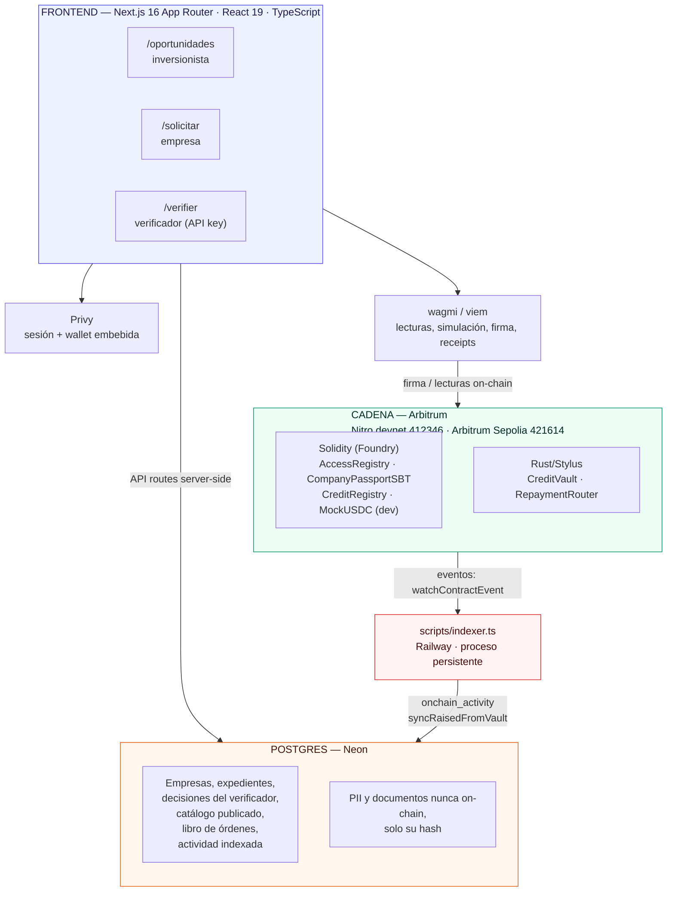
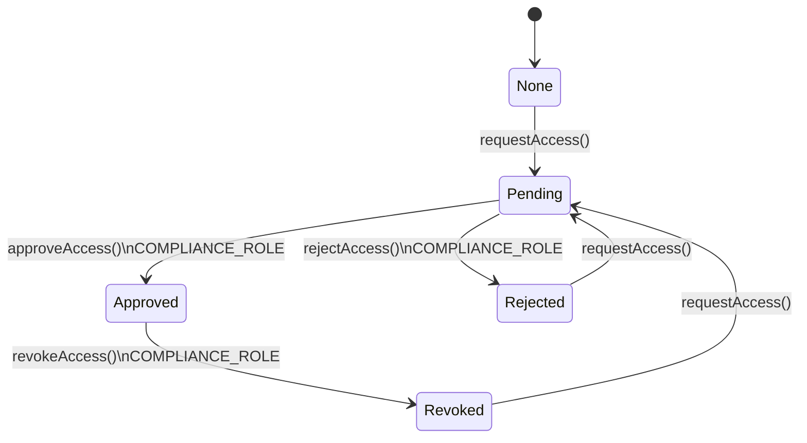
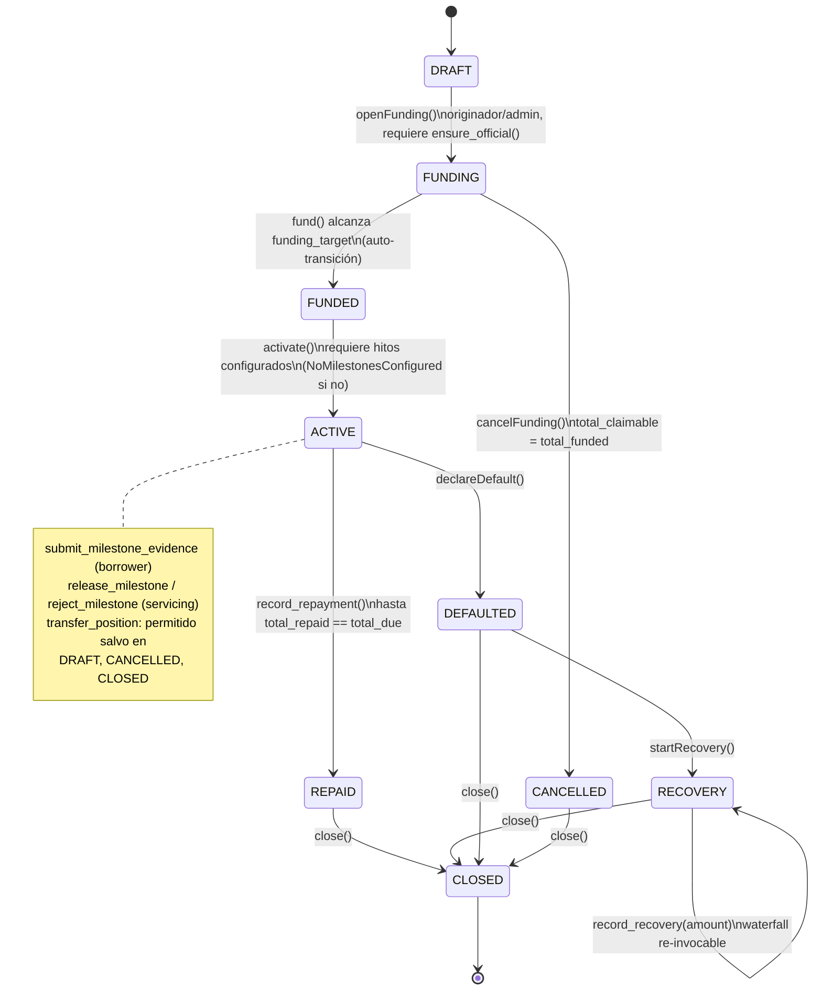
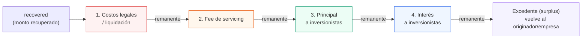
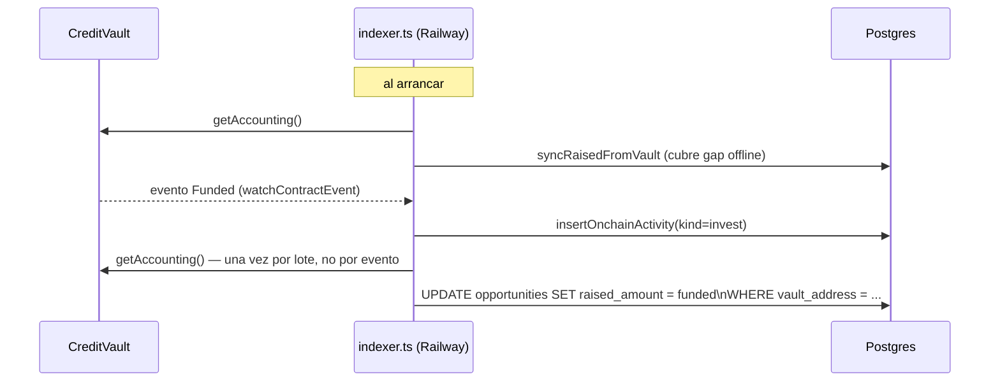
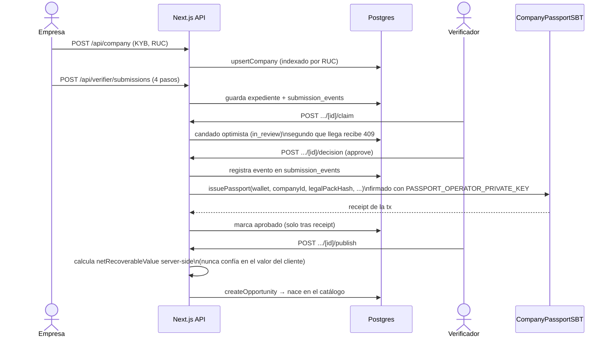
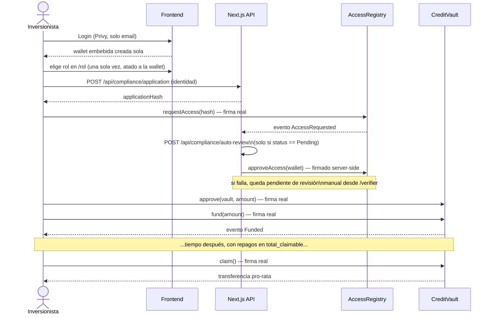
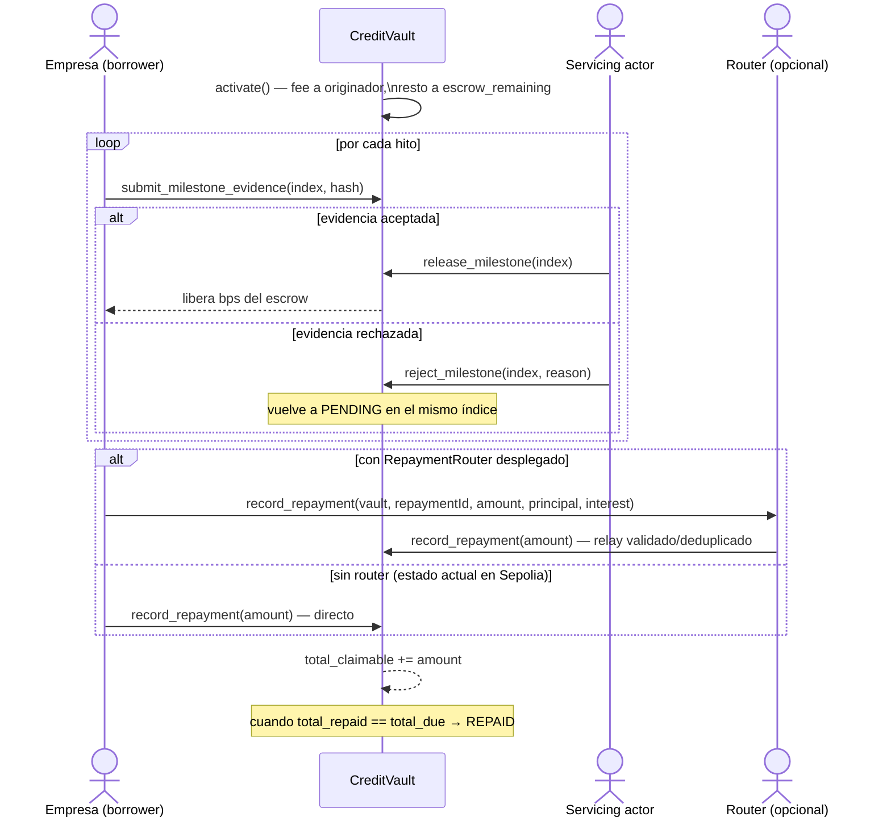
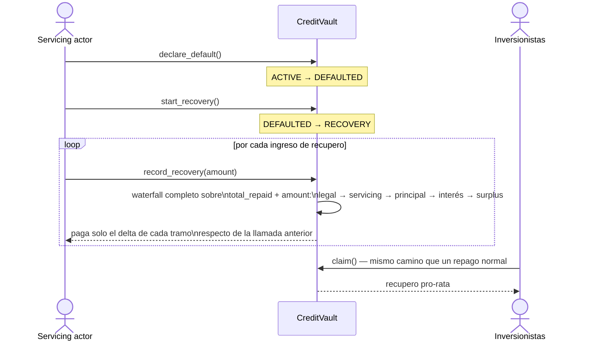
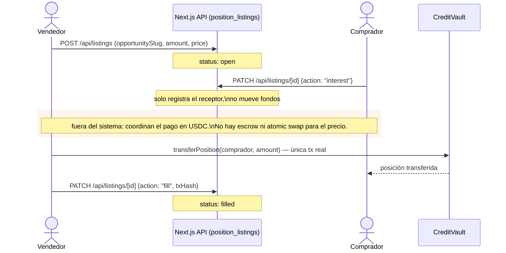

# Arquitectura — Árbitro

Documento único de referencia: qué existe, cómo está construido, cómo fluyen los datos y el dinero, y qué tecnología se usó en cada pieza. Escrito a partir de lectura directa del código el 2026-08-12, no de los documentos de planificación (`build-plan.md`, `stack.md`, `pendientes.md`), que son snapshots de distintas fechas y pueden estar desactualizados. Donde hay diferencia, manda el código.

Complementa, no reemplaza:
- [`start.md`](start.md) — la tesis de negocio.
- [`stack.md`](stack.md) — por qué se eligió cada herramienta.
- [`conceptos-y-cambios.md`](conceptos-y-cambios.md) — el porqué de las decisiones de diseño (SBT, transferencia restringida, fee fijo del verificador).
- [`design-system.md`](design-system.md) — el lenguaje visual.
- [`pendientes.md`](pendientes.md) — qué falta, sesión por sesión.

---

## 1. Qué es Árbitro, en una frase

Un marketplace permissioned de crédito privado para pymes peruanas: la empresa pide capital contra un colateral real, un verificador humano con honorario fijo (no variable) decide si el expediente es financiable, los inversionistas whitelisted aportan USDC que queda en escrow on-chain, el capital se libera por hitos verificados, y los repagos —o el recupero en caso de default— se distribuyen a los inversionistas mediante un waterfall ejecutado por el contrato, no descrito en un PDF.

La blockchain resuelve tres problemas concretos: custodia neutral del dinero (nadie —ni la plataforma ni la empresa— puede tocarlo antes de un hito aprobado), reparto de repagos verificable por cualquiera, y una identidad reputacional portable para la empresa (el pasaporte). No resuelve, ni pretende resolver, la verificación de que un hito ocurrió en el mundo real — eso es documental y humano por diseño (ver `stack.md` §6).

---

## 2. Arquitectura en capas



**Regla de diseño que atraviesa todo el sistema**: nada con PII o información comercial sensible va on-chain. On-chain solo viven montos, estados, roles y hashes (`keccak256` de expedientes, documentos, identidad declarada). Postgres guarda el contenido; la cadena ancla su integridad. Esto es deliberado, no una limitación — está explicado en `stack.md` §4.

---

## 3. Capa on-chain

### 3.1 Por qué Solidity **y** Stylus, no uno solo

- **Solidity/Foundry** para todo lo que es identidad, permisos y registro: `AccessRegistry`, `CompanyPassportSBT`, `CreditRegistry`. Es el default del ecosistema, hay tooling maduro (Foundry: tests, fuzzing, fork testing) y no hay razón para pagar el costo de aprendizaje de Rust en contratos que no hacen cálculo intensivo.
- **Rust/Stylus** para `CreditVault` y `RepaymentRouter`: la máquina financiera (escrow, hitos, waterfall) con aritmética exacta y muchas variables. Stylus compila a WASM y corre en la misma cadena (Arbitrum) con gas signficativamente más barato que EVM puro para lógica con bucles/aritmética compleja — es el componente donde el bounty de Stylus tiene sentido real, no forzado (ver `conceptos-y-cambios.md` Parte 5).

Los dos mundos se comunican por **llamadas cross-contract**: Stylus define interfaces Solidity (`sol_interface!`) para hablarle a `AccessRegistry` y `CreditRegistry`, y Solidity no necesita saber que del otro lado hay WASM — para la EVM, `CreditVault` es un contrato más.

### 3.2 Los contratos Solidity (`packages/foundry/src`)

#### `AccessRegistry.sol` — la whitelist de inversionistas

No hay un contrato `Waitlist.sol` separado: `AccessRegistry` *es* la waitlist. Guarda por inversionista solo un `bytes32 applicationHash` — nunca nombre, documento ni ningún dato personal.



**Ejemplo**: una wallet nueva llama `requestAccess(0xabc...)` con el hash de su identidad declarada. El verificador revisa desde `/verifier` y llama `approveAccess(0x1234...wallet)`. A partir de ahí, `CreditVault.fund()` y `.transferPosition()` para esa wallet dejan de revertir, porque ambos consultan `isAllowedInvestor()` antes de mover un centavo.

- `requestAccess(hash)` — lo llama el propio inversionista.
- `approveAccess` / `rejectAccess` / `revokeAccess` — solo `COMPLIANCE_ROLE`.
- `isAllowedInvestor(addr) view` — `true` solo si `status == Approved` y el contrato no está pausado. Es la función que consulta todo el resto del sistema (`CreditVault.fund`, `.transfer_position`).
- `pause()/unpause()` — `PAUSER_ROLE`.

#### `CompanyPassportSBT.sol` — el pasaporte de negocio

ERC-721 con transferencia bloqueada (`ERC-5192`, soulbound): los métodos `approve`, `setApprovalForAll`, `transferFrom` revierten con `Soulbound()`. Un token por empresa, uno por wallet, no acumulable ni comprable.

Guarda `companyId`, `legalPackHash`, `metadataHash`, `status` (`Verified/Suspended/Revoked/Expired`), `expiresAt`, `riskTier` (1–5). Nunca guarda ventas, RUC ni documentos — eso vive en Postgres; el hash es lo que ancla la integridad.

- `issuePassport(...)` — `ISSUER_ROLE` (el servidor, con `PASSPORT_OPERATOR_PRIVATE_KEY`). Rechaza si la wallet o la empresa ya tienen un pasaporte activo.
- `updateCredential` / `suspendPassport` / `reinstatePassport` — `VERIFIER_ROLE`.
- `revokePassport` — `REVOKER_ROLE`.
- `rotateWallet(tokenId, newWallet)` — `ISSUER_ROLE`; quema el token viejo y remite a la wallet nueva conservando el historial.
- `isVerifiedCompany(wallet) view` — es lo que `CreditVault.ensure_official()` consulta antes de abrir el fondeo o activar.

#### `CreditRegistry.sol` — el ancla de confianza

El contrato que `CreditVault` llama en cada operación que abre estado (`open_funding`, `fund`, `activate`). Guarda, por vault, una foto inmutable de su configuración: `passport`, `accessRegistry`, `paymentToken`, `borrower`, `originator`, `dealId`.

- `registerVault(...)` — `ORIGINATOR_ROLE`; exige que el `borrower` tenga pasaporte verificado y el `paymentToken` esté autorizado.
- `isVaultConfigurationValid(vault, dealId, borrower, originator, paymentToken, passport, accessRegistry) view` — compara campo por campo el registro guardado contra lo que el vault dice tener. Si algo no coincide (alguien cambió el registry global después de registrar el vault), la operación revierte. Es la defensa contra reconfiguración silenciosa.
- `hasRole(role, account)` (heredado de `AccessControl`) — `CreditVault` lo consulta cross-chain para saber si una dirección tiene `SERVICER_ROLE`, sin necesidad de replicar la lista de roles en Stylus.

#### `MockUSDC.sol` — solo desarrollo

ERC-20 de 6 decimales con `faucet()` público (10,000 mUSDC, una vez por dirección). **Nunca debe presentarse como USDC oficial** — así lo dice el propio `README.md`. Es el token de pago por defecto en devnet y en Sepolia hoy, porque el USDC nativo de Circle no tiene faucet y dejaría a cualquier wallet nueva sin forma de invertir (ver §6).

### 3.3 `CreditVault` (Rust/Stylus) — la máquina financiera

`packages/stylus/contracts/credit-vault/src/lib.rs`. Es el contrato central: escrow, hitos, repagos, claims, transferencia restringida y waterfall de default, todo en una sola máquina de estados.



Puntos de diseño que vale la pena explicar porque no son obvios leyendo el nombre de la función:

- **`activate()` exige hitos configurados.** Si `set_milestones` nunca se llamó, `activate()` revierte con `NoMilestonesConfigured`. Es intencional: no hay forma de que el capital salga del escrow sin un cronograma de tramos ya definido.
- **El capital de la empresa no se transfiere entero en `activate()`.** Se cobra el fee de plataforma al `originator` de inmediato, y el resto queda como `escrow_remaining` — solo sale por `release_milestone`, tramo a tramo.
- **Los hitos son secuenciales y con evidencia.** El `borrower` llama `submit_milestone_evidence(index, hash)` solo para el próximo índice pendiente; un actor de servicing (`originator`, `admin`, o quien tenga `SERVICER_ROLE` en `CreditRegistry`) llama `release_milestone` (libera fondos) o `reject_milestone` (vuelve a `PENDING` en el mismo índice, sin perder el cupo).
- **`record_repayment` es interés simple, no amortización.** `total_due = funding_target + funding_target * interest_bps / 10000`. Cada repago suma a `total_claimable`, del cual cada inversionista cobra pro-rata con `claim()`. Al llegar `total_repaid == total_due`, pasa a `REPAID` solo.
- **`claim()` sirve para dos casos con la misma función**: cobrar repagos normales, y —si `cancel_funding()` se ejecutó— recuperar el aporte, porque `cancel_funding` deja `total_claimable = total_funded`.
- **`transfer_position(to, amount)`** es el único movimiento on-chain del mercado secundario: exige que `to` pase `AccessRegistry.isAllowedInvestor`, y mueve tanto la contribución como la porción ya cobrada, proporcionalmente. Bloqueado en `DRAFT`, `CANCELLED` y `CLOSED`.
- **El waterfall (`record_recovery`) es re-invocable e idempotente.** Cada llamada re-corre la cascada completa —costos legales → fee de servicing → principal → interés → excedente— sobre el acumulado `total_repaid + amount`, y paga solo el delta de cada tramo respecto de la llamada anterior. Esto permite que el recupero llegue en partes (una venta de maquinaria, después un cobro de garantía) sin perder la prioridad de pago ni recalcular mal. La lógica es un puerto directo de `computeWaterfall` en `lib/underwriting.ts` (§5.2) — se diseñó primero como función pura en TypeScript precisamente para poder portarla así.
- **Guardas de seguridad**: reentrancy guard manual (`entered` bool), `ensure_official()` re-valida contra `CreditRegistry` y `CompanyPassportSBT` en cada llamada que abre estado (no solo al inicio), aritmética con `checked_add/sub/mul/div` en todo el contrato.

**Ejemplo numérico — hitos sobre un crédito de 100,000 USDC con `platform_fee_bps = 200` (2%) y cronograma `[3000, 2500, 2500, 2000]` (30/25/25/20%):**

```
funded = 100,000 USDC
fee (2%)            = 2,000 USDC  → al originador, en activate()
escrow_remaining     = 98,000 USDC → queda en el contrato

Hito 0 (30%): release_milestone(0) libera 30,000 USDC → escrow_remaining = 68,000
Hito 1 (25%): release_milestone(1) libera 25,000 USDC → escrow_remaining = 43,000
Hito 2 (25%): rechazado (reject_milestone) — el borrower vuelve a
              submit_milestone_evidence(2, nuevoHash) con evidencia corregida
Hito 2 (25%, reintentado): release_milestone(2) libera 25,000 → escrow_remaining = 18,000
Hito 3 (20%): release_milestone(3) libera 20,000 → escrow_remaining = 0
```

El monto de cada tramo se calcula sobre `funding_target`, no sobre `escrow_remaining` — por eso 30+25+25+20 = 100% agota el escrow exacto, siempre que ningún hito se libere dos veces (el propio `status: RELEASED` lo impide).

### 3.4 `RepaymentRouter` (Rust/Stylus) — entrypoint validado de repago

`packages/stylus/contracts/repayment-router/src/lib.rs`. No lleva contabilidad propia — `CreditVault` sigue siendo el libro mayor. Su función es deduplicar y auditar: cada repago trae un `repayment_id`, el router marca `keccak256(vault ++ repayment_id)` como procesado y rechaza reintentos. Verifica que `principal + interest == amount` y que el token del vault coincide con el suyo antes de relayar a `vault.record_repayment(amount)`.

**Hoy no está desplegado en ningún chain registrado** (ni devnet ni Sepolia — confirmado por ausencia en `deployedContracts.ts`). `lib/servicing/onchain.ts` cae automáticamente a llamar `vault.recordRepayment` directo cuando el router no existe, así que el flujo de repago funciona igual sin él; el router es una capa de robustez, no una dependencia dura.

### 3.5 Estado real del despliegue

| | Nitro devnet (`412346`) | Arbitrum Sepolia (`421614`) |
|---|---|---|
| `AccessRegistry` | ✅ | ✅ `0x03f4770018c262fa703ce905698e88a47d52ddc1` |
| `CompanyPassportSBT` | ✅ | ✅ `0xc2457ea101c89884323eca7178df210826372bcc` |
| `CreditRegistry` | ✅ | ✅ `0x2e568d07783fa2152d3b42e49c5fa9f51a818ce8` |
| `CreditVault` | ✅ (+2 copias demo: Happy/Recovery) | ✅ `0xd470aadb20aeae8a225e68fef09a37addbde3797` — única instancia |
| `MockUSDC` | ✅ | ✅ `0xe1a2dcf7ff42b446829d8e9c2c4142691c2f3684` — token de pago del vault |
| `RepaymentRouter` | ❌ no capturado en el manifiesto | ❌ no desplegado |

El vault de Sepolia lleva el mismo bytecode/ABI que el de devnet (incluye `setMilestones`/`getMilestone`), así que la funcionalidad de hitos y waterfall existe en ese contrato — pero **si su cronograma de hitos ya fue seteado y si ya pasó de `DRAFT`** solo se confirma con una lectura on-chain (`get_status()`, `milestone_count()`), no desde el árbol de código. Este documento no asume ese dato.

Solo hay **un** `CreditVault` con dirección fija en Sepolia — no un vault por oportunidad. El tipo `Opportunity.vaultAddress` ya soporta un vault distinto por oportunidad de punta a punta (tipo → wire → Postgres → `useCreditVault`), pero en producción hoy todas apuntan al mismo contrato salvo la que se conectó a mano tras la prueba real (ver `pendientes.md` 0.1).

---

## 4. Capa de datos — Postgres (Neon)

Todo lo que es PII o información comercial sensible: KYB de empresas, expedientes de crédito, identidad declarada por el inversionista, decisiones del verificador, documentos legales, y el catálogo publicado que alimenta la UI. La cadena solo ve el hash.

Tablas relevantes (inferidas del código, `packages/nextjs/lib/`):

- `companies` — identidad de la empresa, **indexada por RUC, no por wallet**: si la misma empresa vuelve a pedir crédito, reutiliza la fila y el historial (`completedDeals`, repagos a tiempo/tarde, defaults) nunca se pisa al re-acreditar, solo lo actualiza el ciclo de vida real del crédito.
- `opportunities` — el catálogo público. Se llena solo cuando el verificador **publica** un expediente aprobado (`POST /api/verifier/submissions/[id]/publish`); nunca se escribe a mano.
- `access_applications` — identidad declarada por el inversionista antes de anclar su hash en `AccessRegistry`.
- `submission_events` — bitácora de auditoría de cada expediente: cada transición de estado queda escrita, es lo que la empresa lee como seguimiento en `/solicitar`.
- `position_listings` — el libro de órdenes del mercado secundario (§7.4).
- `onchain_activity` — la tabla que llena el indexer (§6), la única fuente de actividad "real" mostrada en el portafolio.

**Fallback explícito, nunca silencioso**: si Postgres no responde, el catálogo cae al seed estático (`lib/data/seed.ts`) y la UI lo declara con un flag `usingSeedData` — no se disimula.

---

## 5. Lógica de negocio (dominio)

### 5.1 El modelo (`packages/nextjs/lib/types.ts`)

Dos convenciones que se aplican en todo el sistema, de la UI al contrato: **montos en `bigint`, micro-USDC** (`1_500_000_000n` = 1,500 USDC — exactamente lo que devuelve el contrato, sin conversión de por medio) y **tasas en basis points** (14.5% APY = `1450`, igual que en Solidity/Rust). Esta decisión evitó reescribir la capa de datos cuando el prototipo pasó de mock a on-chain real.

Entidades centrales:
- `Opportunity` — el deal: monto objetivo, recaudado, plazo, APY, estado (`review → funding → active → repaid | defaulted`), colateral, hitos, `legalPackHash`, `vaultAddress`.
- `Collateral` — `appraisedValue` es solo referencia; **`netRecoverableValue` (valor tasado menos el haircut por tipo de activo) es el único número que entra en las decisiones de crédito.** Haircuts por defecto: inmueble 30%, maquinaria 35%, vehículo 40% (`HAIRCUT_BY_KIND`), aplicados al publicar y nunca reducibles por el verificador, solo aumentables.
- `Passport` — historial derivado de actividad on-chain real: ventas verificadas, deals completados, pagos a tiempo/tarde, defaults.
- `Position` — el ticket del inversionista, transferible solo entre wallets verificadas.
- `Milestone` — `releaseBps` (qué % del capital libera), estado, hash de evidencia.

### 5.2 El motor de underwriting (`lib/underwriting.ts`) — funciones puras y deterministas

Diseñadas explícitamente como la especificación ejecutable que después se portó al contrato: mismos datos → mismo resultado, auditable por cualquiera, sin caja negra.

**`computeScore(o)`** — score 0–1000 en cinco factores ponderados:

| Factor | Máximo | Fórmula |
|---|---|---|
| Antigüedad | 150 | satura a los 10 años |
| Cobertura de ventas verificadas | 250 | satura a 6x el monto objetivo |
| Cobertura de colateral | 250 | `netRecoverableValue / targetAmount`, satura a 1.6x |
| Aporte propio (*skin in the game*) | 150 | satura al 30% |
| Historial de repago | 200 | sin historial previo = medio crédito (0.5), no cero; con historial: `(a_tiempo − 0.5×tarde − 3×default) / total` |

`gradeOf(score)`: A ≥ 800, B ≥ 680, C ≥ 560, D ≥ 440, si no E.

**`suggestedApy(score)`** — mapeo lineal inverso, 13%–22% APY, redondeado a 25bps: mejor score, mejor tasa.

**Ejemplo — una pyme de 6 años, pide 100,000 USDC, ventas verificadas 350,000/año, colateral con `netRecoverableValue` 140,000, aporte propio 20%, historial: 8 pagos a tiempo, 1 tarde, 0 default:**

```
Antigüedad:     min(6/10, 1)      × 150 = 90.0
Ventas:         min(350k/100k/6,1)× 250 = 250.0   (satura: 3.5x ya pasa el 6x techo... en
                                                    realidad 350k/100k = 3.5, /6 = 0.58 → 145.8)
Colateral:      min(140k/100k /1.6,1)×250 = 218.75 (1.4x cobertura, techo en 1.6x)
Skin in game:   min(20%/30%,1)    × 150 = 100.0
Historial:      (8 − 0.5×1 − 3×0)/9 × 200 = 166.7

score ≈ 90 + 145.8 + 218.75 + 100 + 166.7 ≈ 721  →  grado B
suggestedApy(721) = 2200 − (721/1000)×900 ≈ 1551 bps ≈ 15.5% APY
```

(Números redondeados a fines ilustrativos; el código usa aritmética exacta con `clamp`/`Math.round` a 25bps.)

**`computeWaterfall(recovered, costos)`** — la cascada de prioridad de pago, la misma que corre `CreditVault.record_recovery` on-chain:



Costos por defecto del prototipo: legal 6%, servicing 1.5% (`DEFAULT_COSTS`), ambos sobre el principal.

**Ejemplo — default sobre un crédito de 100,000 USDC, interés 12% (`total_due = 112,000`), se recupera en dos partes (venta de maquinaria + cobro de garantía):**

```
legal    = 100,000 × 6%   = 6,000
servicing= 100,000 × 1.5% = 1,500
principal = 100,000
interés   = 12,000
total a cubrir = 6,000 + 1,500 + 100,000 + 12,000 = 119,500

Llamada 1 — record_recovery(78,400):
  legal:      paga 6,000   (queda 72,400)
  servicing:  paga 1,500   (queda 70,900)
  principal:  paga 70,900  (de 100,000 → falta 29,100)
  interés:    paga 0       (no alcanzó)
  → investorRecoveryBps ≈ 70,900 / 112,000 ≈ 63.3%

Llamada 2 — record_recovery(41,100) [recupero acumulado = 119,500]:
  legal/servicing: ya cubiertos, delta = 0
  principal: paga el resto, 29,100   (principal completo: 100,000)
  interés:   paga 12,000 completo
  surplus:   0
  → investorRecoveryBps = 100%  (recupero total, tarde pero completo)
```

Cada llamada solo paga el *delta* de cada tramo respecto de lo ya pagado — así el waterfall es correcto sin importar en cuántas partes llegue el recupero.

**Escenario de default** (`totalACubrir`, `lossBufferBps`, `recoveryOnDefaultBps`) se calcula deliberadamente contra el **monto objetivo**, no lo recaudado hasta el momento — para que el número no se evapore a medida que entra más capital. Es lo que arma el caso "¿y si sale mal?" del pitch: el deal en default del seed (cobertura 0.95x, garantía sin inscribir, historial con 4 pagos tardíos) está construido justamente para responder esa pregunta con datos, no con una promesa.

### 5.3 Cómo gana dinero la plataforma

Definido en `conceptos-y-cambios.md` Parte 3, con un cambio de diseño clave respecto del modelo original: **no hay fee de éxito sobre capital levantado**, porque crea el sesgo de aprobar de más — el mismo problema que reventó a las calificadoras de riesgo en 2008. En su lugar:

| Fee | Quién paga | Cuándo | A quién |
|---|---|---|---|
| Verificación | Empresa | Al enviar el expediente, antes del resultado | Verificador (fijo, no % del monto) |
| Originación | Empresa | Del primer desembolso | Plataforma |
| Servicing | Empresa | De cada repago | Plataforma |
| Mora | Empresa | Al atrasarse | Se reparte con inversionistas |
| Recupero en default | Sale del recupero | En liquidación | Plataforma (posición 2 del waterfall) |

El verificador cobra fijo, apruebe o rechace — su ingreso no depende del resultado. La plataforma gana cuando los créditos **se pagan**, no cuando se aprueban. El fee de verificación y el stake del verificador (garantía que se pierde parcialmente si aprobó algo que cae en default por algo que debió detectar) **no están construidos todavía** — es lógica de negocio pendiente, no técnica.

**Ejemplo — crédito de 100,000 USDC a 12 meses, `platform_fee_bps = 200` (2%), interés 12%:**

```
Verificación:  300 USDC fijos, cobrados a la empresa al enviar el expediente,
               antes de saber si se aprueba — van al verificador.

Originación:   100,000 × 2% = 2,000 USDC, descontados del desembolso en activate()
               → la empresa recibe 98,000 USDC de escrow, no 100,000.
               (Este fee ya está implementado como platform_fee_bps en el contrato;
               el resto de la tabla — verificación fija y stake — es diseño, no código.)

Repago total:  112,000 USDC (100,000 principal + 12,000 interés)
               → los inversionistas cobran esto pro-rata vía claim().
```

---

## 6. El indexer — cómo la cadena y Postgres se mantienen sincronizados

`packages/nextjs/scripts/indexer.ts`, proceso persistente en Railway (no serverless — un listener de eventos no sobrevive en Vercel/funciones efímeras).

Escucha eventos de un `CreditVault` fijo vía `viem.watchContractEvent` y los traduce a `onchain_activity`:

| Evento on-chain | `ActivityKind` |
|---|---|
| `Funded` | `invest` |
| `Activated` | `release` |
| `RepaymentRecorded` | `repayment` |
| `Claimed` | `repayment` |
| `DefaultDeclared` | `default` |
| `RecoveryStarted` | `recovery` |
| `RecoveryRecorded` | `recovery` |



**Ejemplo real** (documentado en `pendientes.md`, sesión del 10 de agosto): el vault decía 5,500 USDC recaudados on-chain, pero el catálogo mostraba 2,000 — alguien invirtió 3,500 después de un arreglo manual anterior. `syncRaisedFromVault` corrió contra Neon y corrigió la fila sin intervención manual. Es exactamente el bug que este mecanismo existe para no repetir.

Después de cada lote de logs que incluya un `Funded`, relee `getAccounting()` del vault y actualiza `opportunities.raised_amount` (`syncRaisedFromVault`) — no evento por evento, porque el contrato ya acumuló todo, así que una lectura al final del lote basta. Corre también una vez al arrancar, para cubrir inversiones que hayan ocurrido mientras el indexer estaba caído.

**Decisión deliberada**: `investor_count` nunca se recalcula desde `onchain_activity`, porque el indexer solo ve eventos desde que empezó a escuchar — contar daría un número falso para una oportunidad fondeada antes de que el indexer arrancara. Preferible viejo a inventado.

**Limitación actual**: el indexer está fijo a un único `CreditVault`, no a un listener por oportunidad — coherente con que hoy solo hay una instancia de vault en Sepolia en uso real.

---

## 7. Flujos de extremo a extremo

### 7.1 Empresa: expediente → pasaporte → oportunidad publicada



### 7.2 Inversionista: acceso → inversión → cobro



### 7.3 Ciclo de vida del crédito (hitos y repago)



Hoy `MilestoneTimeline` en la UI es de **solo lectura** sobre datos de Postgres — no lee `get_milestone`/`escrow_remaining` del contrato todavía, y la publicación de una oportunidad no tiene interfaz para configurar `set_milestones` (solo `deploy.ts` lo hace, con el cronograma fijo `[30%, 25%, 25%, 20%]`).

### 7.4 Default y waterfall



### 7.5 Mercado secundario — qué es on-chain y qué es coordinación manual



Esto es una brecha de diseño conocida y documentada, no un descuido: el pago del precio entre comprador y vendedor no tiene garantía criptográfica hoy. Cerrarlo (escrow o atomic swap del lado del precio) es el primer punto de `pendientes.md` §"Siguiente paso".

---

## 8. Frontend — superficies, roles y autenticación

### 8.1 Las tres superficies

| Superficie | Home | Quién entra | Protección |
|---|---|---|---|
| Inversionista | `/oportunidades` | rol `investor` | sesión Privy + rol asignado |
| Empresa | `/solicitar` | rol `business` | sesión Privy + rol asignado |
| Verificador | `/verifier` | staff interno | API key en `localStorage`, `requireVerifierAuth` server-side — **no** usa Privy |

`/` no renderiza nada: mira la sesión y reparte a `/login`, `/rol`, o el home del rol. `/login` es la única puerta de entrada para inversionista y empresa. El rol se elige una vez en `/rol` y queda atado a la wallet (`chooseRole`, `lib/intendedRole.ts`) — quien intenta entrar por el lado que no es el suyo recibe una pantalla explícita (`RoleConflict`), no un redirect silencioso.

### 8.2 Sesión y wallet (Privy)

`PrivyProvider` envuelve a `WagmiProvider` (el conector de `@privy-io/wagmi` necesita el contexto de Privy). Login solo por email; toda cuenta nueva recibe una wallet embebida al instante (`createOnLogin: "all-users"`) — no hay pantalla de conectar wallet externa. Los modales de confirmación de Privy están desactivados (`showWalletUIs: false`): la propia UI del producto (p. ej. `InvestPanel`) ya pregunta con monto, calificación y riesgo en castellano antes de firmar; el modal de Privy era una segunda confirmación en inglés, redundante.

`useSession()` es la fuente única de verdad: dirección desde `user.wallet.address` de Privy directamente (no desde `wagmi.useAccount()`, que puede rezagarse en un reload frío), estado de verificación desde lecturas on-chain de `AccessRegistry`, rol desde `localStorage` por wallet. Cierre de sesión "suave": oculta la sesión y mantiene el token de Privy vivo 60 minutos, para poder retomarla sin pedir el código de verificación de nuevo.

Toda ruta de API autenticada deriva la wallet **del token verificado de Privy**, nunca del cuerpo de la petición — así en `/api/company`, `/api/compliance/application`, `/api/faucet`, `/api/account/delete`, etc.

### 8.3 Componentes por dominio

```
components/chrome/   AppShell, TopNav — el marco de la app
components/ui/        Button, Pill, ProgressBar, Stat, Table, Field, Modal
                       — primitivos propios, no shadcn (~200 líneas total,
                       decisión cerrada en stack.md: los componentes del
                       producto son de dominio, no genéricos)
components/domain/    OpportunityCard, CollateralPanel, MilestoneTimeline,
                       WaterfallPanel, ScorePanel, PassportPanel, InvestPanel,
                       OrderBook, PortfolioOverlay, ActivityRow, ScoreBadge
```

### 8.4 Hooks clave sobre la cadena

- `useCreditVault` — envuelve el `CreditVault` (con override de dirección por oportunidad, o el deployment fijo por defecto). Lecturas: `status`, `totalFunded`, `getInvestorPosition`. Escrituras: `fund`, `claim`, `transferPosition`.
- `useSaldo` — única fuente del saldo mostrado; si hay token de protocolo desplegado en la chain activa, la verdad es el saldo on-chain; si no, cae al saldo simulado de `usePlatform()`, etiquetado como tal, sin mezclar las dos fuentes.
- `useAccessRegistry` — `isAllowedInvestor`, `getAccessRecord`, `requestAccess`.
- `useCompanyEvidence` — expediente público de una empresa vía React Query.

---

## 9. Infraestructura y operación

| Pieza | Tecnología | Rol |
|---|---|---|
| Frontend | Vercel (Next.js) | deploy sin fricción, según `stack.md` |
| Indexer | Railway (proceso persistente, Nixpacks) | escucha eventos del vault, no puede ser serverless |
| Base de datos | Neon (Postgres) | KYB, expedientes, catálogo, listado secundario, actividad |
| RPC devnet | Nitro local (`nitro-devnode/`) | `http://127.0.0.1:8547`, chain `412346` |
| RPC testnet | Alchemy o equivalente vía `ARBITRUM_SEPOLIA_RPC_URL` | chain `421614` |
| Explorador | Arbiscan | verificación de contratos (pendiente para las direcciones actuales de Sepolia) |
| CI | `forge test`, `forge fmt`, `cargo test`, `cargo clippy -D warnings`, `next:lint`, `next:check-types` | ver comandos en `README.md` |

---

## 10. Qué es real hoy y qué sigue simulado

Vale la pena tenerlo explícito porque el propio `README.md` y `pendientes.md` lo declaran así — es parte del posicionamiento honesto del proyecto, no algo a ocultar en una demo.

**Real, de punta a punta (toca la cadena o Postgres de verdad):**
- Login y wallet embebida (Privy).
- Expediente de empresa → Postgres, hash anclado como `legalPackHash`.
- Decisión del verificador → `CompanyPassportSBT` emitido on-chain, con receipt esperado antes de marcar aprobado.
- Publicación de oportunidades → catálogo servido desde Postgres, no desde el seed.
- Acceso del inversionista → `AccessRegistry.requestAccess` + `approveAccess` on-chain.
- Invertir y cobrar → `approve` + `fund` + `claim` contra `CreditVault`.
- Mercado secundario → `transferPosition` real cuando el vendedor confirma un fill.
- Recaudación del catálogo → sincronizada desde `getAccounting()` por el indexer, no editada a mano.

**Todavía simulado o incompleto:**
- Saldo, posiciones y actividad "local" del portafolio viven en `localStorage` por wallet (la actividad se reemplaza por la real en cuanto el indexer tiene filas).
- Hitos: de solo lectura en la UI; no hay pantalla para `set_milestones` al publicar.
- El waterfall se muestra en la UI calculado por `underwriting.ts`, no leído del contrato.
- El pago del precio en el mercado secundario es coordinación manual (§7.5).
- Un solo `CreditVault` en Sepolia para todas las oportunidades activas.
- `RepaymentRouter` no desplegado en ningún chain con manifiesto registrado.
- Fee fijo de verificación y stake del verificador: no construidos.
- On/off-ramp fiat: solo simulado del lado inversionista (PEN → USDC mock); del lado empresa no existe ni como mock.

---

## 11. Tecnología aplicada, por componente — resumen

| Componente | Tecnología | Por qué |
|---|---|---|
| Identidad y permisos on-chain | Solidity + Foundry + OpenZeppelin AccessControl | maduro, tooling de testing fuerte, no necesita cálculo intensivo |
| Escrow, hitos, waterfall | Rust + Stylus (WASM sobre Arbitrum) | aritmética y ramas complejas más baratas que en EVM puro; único punto donde Stylus se justifica de verdad |
| Pasaporte de empresa | ERC-721 modificado a soulbound (ERC-5192) | reputación no debe ser comprable ni vendible |
| Posición del inversionista | ERC-20-like con transferencia restringida (dentro del propio `CreditVault`, vía `AccessRegistry`) | liquidez sin abrir el marketplace a cualquiera — resuelve la tensión entre "quiero poder vender" y "no puede circular libremente" |
| Frontend | Next.js 16 App Router + React 19 + TypeScript | server-side real necesario para no exponer PII a un SPA puro |
| Estado de cadena | wagmi + viem | cliente tipado, hooks de React, evita escribir todo a mano |
| Sesión y wallet | Privy (email + wallet embebida) | el usuario objetivo (CFO, dueño de pyme) no es cripto-nativo |
| Estilos | Tailwind v4, tokens en `@theme inline` | permitió cambiar el lenguaje visual completo cuatro veces sin tocar la lógica de los componentes |
| Datos sensibles | PostgreSQL (Neon) | KYC/KYB, documentos, decisiones — no puede ir on-chain |
| Documentos | Storage privado + hash `keccak256` on-chain | integridad verificable sin filtrar PII |
| Indexación | `viem.watchContractEvent` + proceso persistente en Railway | volumen bajo, no justifica The Graph todavía |
| Motor de underwriting | TypeScript puro (`lib/underwriting.ts`), candidato futuro a Stylus | especificación ejecutable, determinista, portada 1:1 al contrato para el waterfall |

---

## 12. Dónde seguir para más detalle

- Contratos Solidity: `packages/foundry/src/*.sol` + tests en `packages/foundry/test/`.
- Contratos Stylus: `packages/stylus/contracts/credit-vault/src/lib.rs` y `packages/stylus/contracts/repayment-router/src/lib.rs`.
- Script de deploy: `packages/stylus/scripts/deploy.ts` (orden completo de despliegue y wiring).
- Lógica de dominio: `packages/nextjs/lib/underwriting.ts`, `lib/types.ts`, `lib/opportunity.ts`.
- Flujo de acceso del inversionista: `packages/nextjs/lib/useSession.tsx`.
- Indexer: `packages/nextjs/scripts/indexer.ts`.
- Estado de avance y bloqueadores vivos: [`pendientes.md`](pendientes.md).
